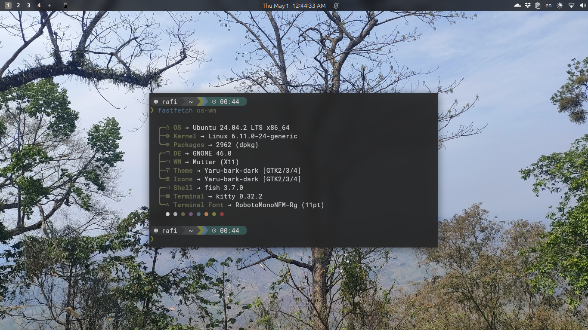
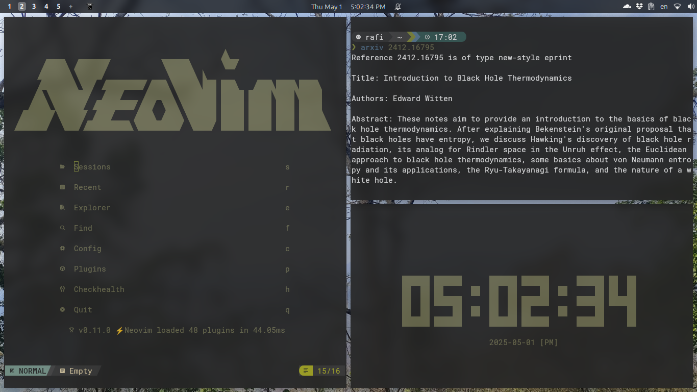
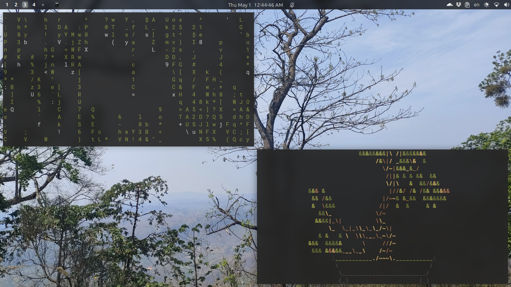
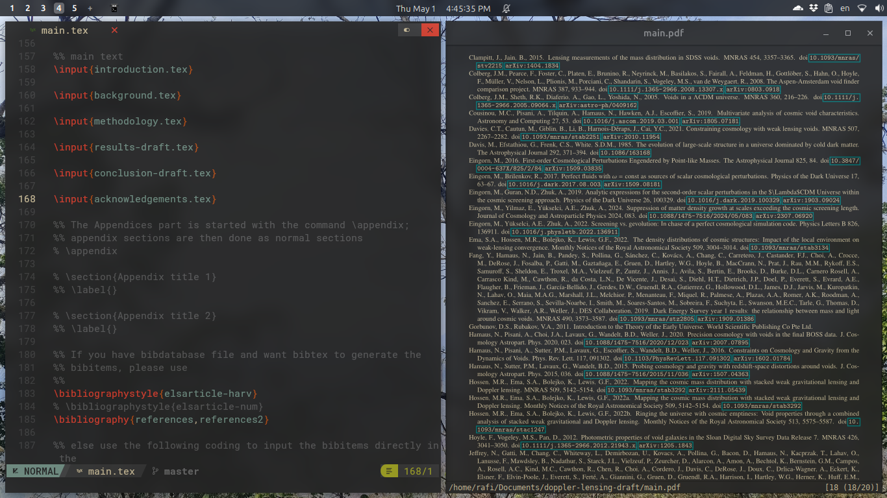
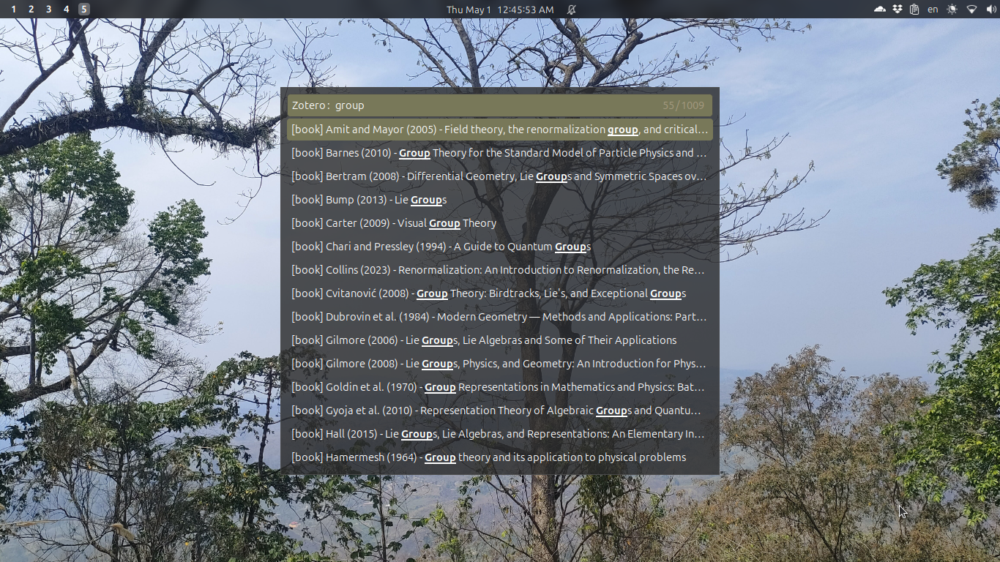
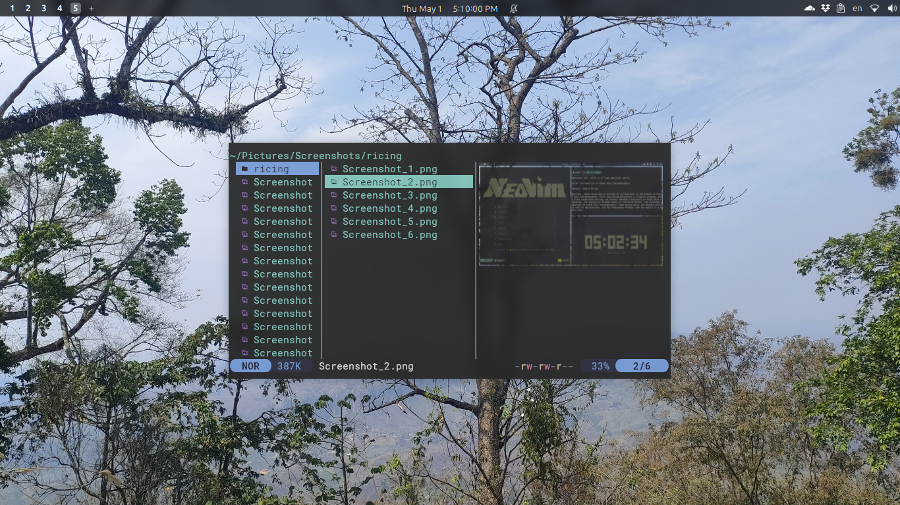
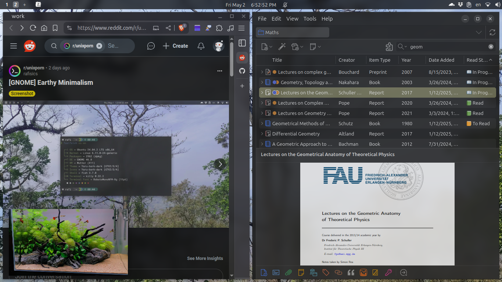

# dotfiles

Personal dotfiles for Ubuntu GNOME (X11), managed with [GNU Stow](https://www.gnu.org/software/stow/).

## Screenshots — [Earthy Minimalism](https://www.reddit.com/r/unixporn/comments/1kbpgr5/gnome_earthy_minimalism/)

| | |
|---|---|
|  |  |
|  |  |
|  |  |
|  |  |

## Install on a fresh machine

```bash
git clone https://github.com/rafisics/dotfiles.git ~/dotfiles
cd ~/dotfiles
bash install.sh
```

Then see [system/KEYBOARD-SHORTCUTS.md](system/KEYBOARD-SHORTCUTS.md) for GNOME keybinding restore and [system/dpkg/manual-packages.txt](system/dpkg/manual-packages.txt) for the full apt package list.

Two tools are installed manually (not via apt):
- **yazi** — file manager: [github.com/sxyazi/yazi](https://github.com/sxyazi/yazi) releases
- **giph** — gif recorder: [github.com/phw/giph](https://github.com/phw/giph) (shell script, `screenkey` + `giph -s out.gif`)

## Packages

| Package | What it configures | Docs |
|---|---|---|
| `bash` | `.bashrc`, `.bash_profile`, `.bash_logout`, `.stow-global-ignore` | — |
| `git` | `.gitconfig` (identity, credential helper) | — |
| `nvim` | Neovim (NvChad) + `nvim.fish` helper functions | [nvim/README.md](nvim/README.md) |
| `nvim-tex` | NeoTeX — LaTeX-focused config (benbrastmckie/nvim) | [nvim-tex/README.md](nvim-tex/README.md) |
| `fish` | Fish shell — config, functions, variables | [fish/README.md](fish/README.md) |
| `starship` | Three prompt configs, switch with `starships` | [starship/README.md](starship/README.md) |
| `kitty` | Kitty terminal | — |
| `rofi` | Rofi launcher + rofi-zotero | [rofi/README.md](rofi/README.md) |
| `zathura` | Zathura PDF viewer + themes | — |
| `yazi` | Yazi file manager (catppuccin theme) | — |
| `btop` | btop resource monitor | — |
| `fastfetch` | Fastfetch preset (`os-wm.jsonc`) — used in Screenshot 1 | — |
| `screenkey` | Screenkey config (`~/.config/screenkey.json`) — font, opacity, position for keyboard overlay gifs | — |
| `mimeapps` | Default application associations (`~/.config/mimeapps.list`) — Brave for web, etc. | — |
| `flameshot` | Flameshot screenshot config — save path, filename pattern, draw thickness | — |
| `wallpaper` | Wallpaper at `~/.config/background` + `~/.local/share/backgrounds/` (1920×1080, resized from original) | — |
| `i3` | i3 WM *(archived — not stowed on GNOME)* | [Shortcuts](system/KEYBOARD-SHORTCUTS.md#i3-keybindings-archived--not-active-on-gnome) |
| `polybar` | Polybar *(archived — not stowed on GNOME)* | — |
| `picom` | Picom compositor *(archived — not stowed on GNOME)* | — |

> i3/polybar/picom packages are kept for reference or non-GNOME machines. `install.sh` does not stow them by default.

## System setup

`system/` contains:
- `dpkg/manual-packages.txt` — manually installed packages
- `gnome/` — GNOME dconf exports (full settings, keybindings, extensions)
- `img/` — screenshots of GNOME extension settings
- `KEYBOARD-SHORTCUTS.md` — all keybindings documented
- `THEME.md` — GTK theme, fonts, wallpaper, extension restore guide

Restore GNOME keybindings on a new machine:
```bash
dconf load /org/gnome/desktop/wm/keybindings/       < system/gnome/keybindings/wm.dconf
dconf load /org/gnome/shell/keybindings/            < system/gnome/keybindings/shell.dconf
dconf load /org/gnome/settings-daemon/plugins/media-keys/ < system/gnome/keybindings/media-keys.dconf
```

Or just run the fish function: `load_gnome_settings`

## Private git identity

`git/.gitconfig-private` is gitignored (holds your GitHub no-reply email).
Copy the example and fill it in:

```bash
cp git/.gitconfig-private.example git/.gitconfig-private
# edit with your email
stow git
```

## Adding a new app

```bash
mkdir -p <app>/.config/<app>
# copy config files in
stow <app>
```
