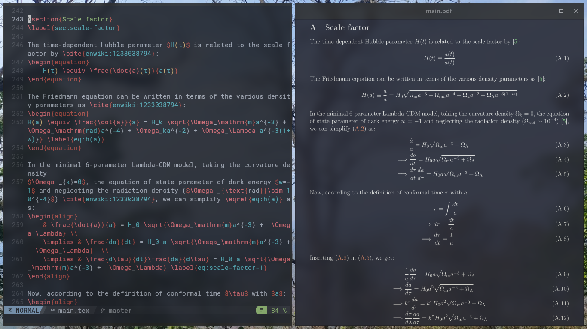
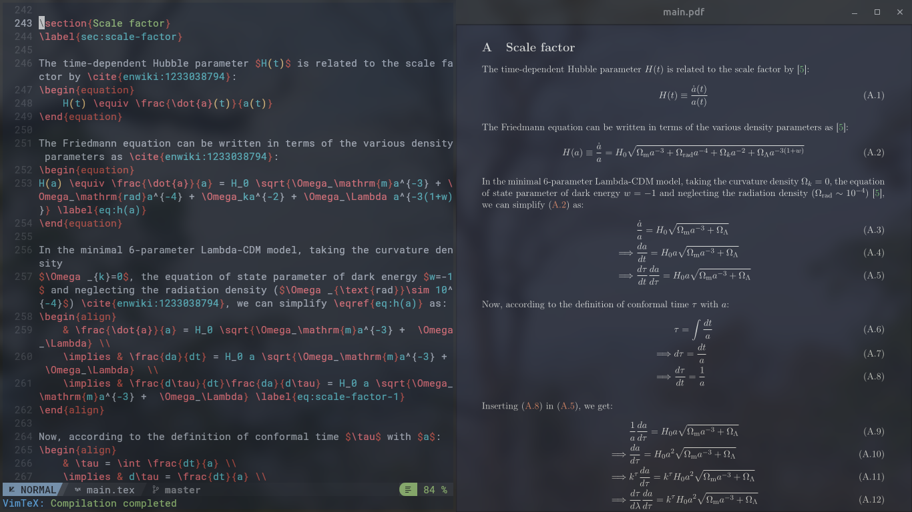
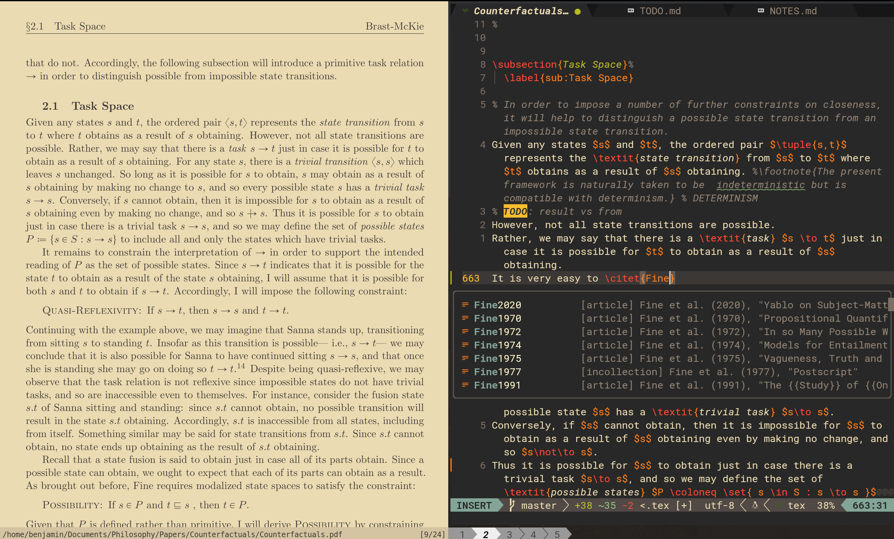
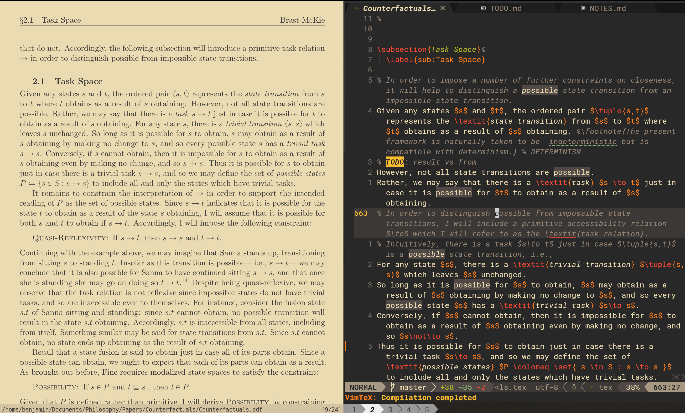
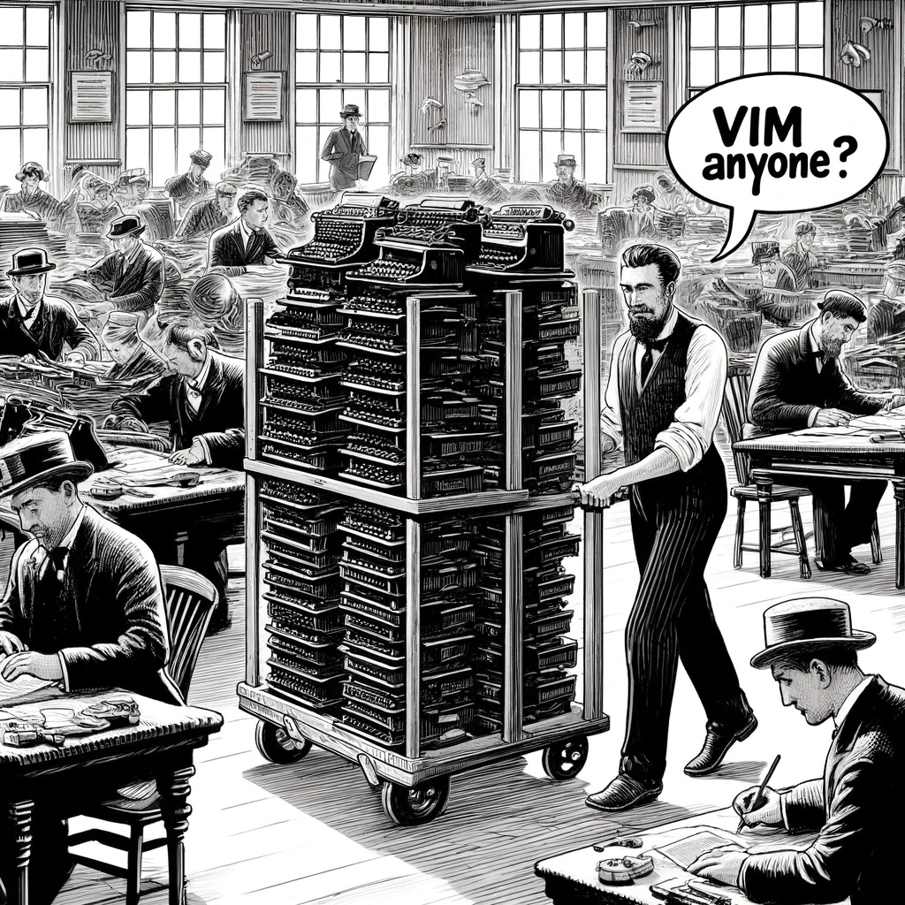

# Neovim config

Built on [NvChad](https://nvchad.com/) v2. Entry point: `.config/nvim/init.lua`.



## Plugins

| Plugin | Purpose |
|---|---|
| **nvim-lspconfig** + **mason.nvim** | LSP — lua-language-server, html, cssls |
| **conform.nvim** | Formatting (stylua, bibtex-tidy) |
| **nvim-treesitter** | Syntax highlighting |
| **nvim-cmp** + **LuaSnip** | Completion + snippets |
| **telescope.nvim** | Fuzzy finder — files, buffers, live grep |
| **vimtex** | LaTeX editing (compile, synctex, cmp source) |
| **gitsigns.nvim** | Git diff in gutter |
| **lazygit.nvim** | LazyGit TUI inside nvim |
| **alpha.nvim** | Dashboard |
| **snacks.nvim** | Image previews, notifier, picker |
| **toggleterm.nvim** | Floating terminal (fish shell) |
| **yazi.nvim** | Yazi file manager inside nvim |
| **nvim-surround** | Surround motions |
| **nvim-autopairs** | Auto-close brackets |
| **Comment.nvim** | Line/block comments |
| **which-key.nvim** | Keymap popup |
| **yanky.nvim** | Yank ring history |
| **nvim-colorizer** | Inline colour previews |
| **local-highlight.nvim** | Highlight word under cursor |
| **dressing.nvim** | Better `vim.ui` popups |
| **minimap.vim** | Code minimap sidebar |
| **sessions (persisted)** | Auto-save/restore sessions |
| **showkeys.nvim** | Live keypress display |

## Key mappings

Leader key: `Space`

### Navigation
| Key | Action |
|---|---|
| `Ctrl+h/j/k/l` | Move between windows |
| `Tab` / `Shift+Tab` | Next / previous buffer |
| `Shift+H` / `Shift+L` | Line start / end (display) |
| `j` / `k` | Move by display line (wraps) |
| `m` | Scroll cursor to top of view |
| `Ctrl+U` / `Ctrl+D` | Half-page scroll, centered |
| `E` | Move back to end of previous word |

### Editing
| Key | Action |
|---|---|
| `<` / `>` | Indent/dedent (normal + visual, stays in mode) |
| `Alt+J` / `Alt+K` | Move line(s) down/up |
| `Alt+Left/Right` | Resize split |
| `Ctrl+/` | Toggle comment |
| `Enter` | Clear search highlight |

### Tools
| Key | Action |
|---|---|
| `Ctrl+P` | Telescope file finder |
| `Ctrl+\`` | Float terminal (fish, in file dir) |
| `Shift+T` | Toggle transparency |
| `Space mm` | Toggle minimap |
| `Shift+M` | Open help for word under cursor |

### Leader key (`Space`) — single keys
| Key | Action |
|---|---|
| `Space b` | VimTeX compile |
| `Space c` | Create vertical split |
| `Space d` | Delete buffer |
| `Space e` | Toggle file explorer (NvimTree) |
| `Space i` | VimTeX table of contents |
| `Space j` | Close split |
| `Space k` | Maximize split |
| `Space q` | Quit all |
| `Space v` | VimTeX view PDF |
| `Space w` | Save all |

### Leader submenus
| Prefix | Menu | Actions |
|---|---|---|
| `Space a` | ACTIONS | `a` annotate, `b` bib export, `c` clear vimtex, `f` format, `h` highlight toggle, `k` kill aux, `r` report errors, `u` update cwd, `v` vimtex menu, `w` word count |
| `Space f` | FIND | `b` buffers, `f` project grep, `g` git history, `h` help, `k` keymaps, `r` registers, `t` theme, `y` yanks |
| `Space g` | GIT | `b` checkout branch, `d` diff, `g` lazygit, `j` next hunk, `k` prev hunk, `l` line blame, `p` preview hunk, `t` toggle blame |
| `Space l` | LSP | `b` buffer diagnostics, `c` code action, `d` definition, `D` declaration, `h` hover, `i` implementations, `k` kill lsp, `l` line diagnostics, `n` next diagnostic, `p` prev diagnostic, `r` references, `R` rename, `s` restart lsp, `t` start lsp |
| `Space m` | MINIMAP | `m` toggle |
| `Space s` | SURROUND | `s` surround, `d` delete, `c` change |
| `Space S` | SESSIONS | `s` save, `d` delete, `l` load |
| `Space y` | YAZI | `y` current file, `w` open in cwd |

## Config switching

Two configs are maintained and both are tracked in this repo:
- **NvChad** (`~/.config/nvim/`) — this package, general-purpose
- **NeoTeX** (`~/.config/nvim-tex/`) — see [nvim-tex/README.md](../nvim-tex/README.md), LaTeX-focused, based on [benbrastmckie/nvim](https://github.com/benbrastmckie/nvim)

Switch via fish shell:
```fish
nvims        # fzf picker: NvChad or NeoTeX
nvim-tex     # launch NeoTeX directly
Ctrl+A       # quick nvims picker from any prompt
```

## Screenshots

| | |
|---|---|
|  |  |
|  |  |
|  |  |
