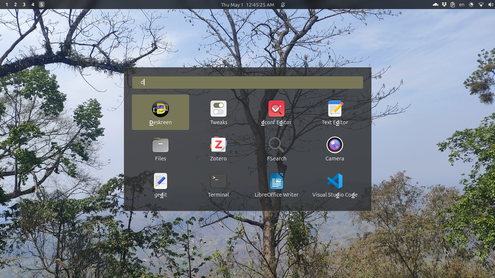

# Rofi

[Rofi](https://github.com/davatorium/rofi) application launcher, configured with a custom theme and integrated with Zotero.



## Configs

| File | Purpose |
|---|---|
| `.config/rofi/config.rasi` | Default rofi config (theme, keybindings) |
| `.config/rofi/rofi-default.rasi` | Base theme file |
| `.config/rofi-zotero/rofi-zotero.py` | Zotero attachment launcher script |
| `.config/rofi-zotero/themes/` | Zotero-specific rofi themes |

## GNOME keybindings

| Shortcut | Action |
|---|---|
| `Super + Shift + P` | Launch rofi app picker (`rofi -show drun`) |
| `Super + Z` | Launch rofi-zotero picker |

## rofi-zotero

Searches your Zotero library and opens PDF/DjVu attachments directly from a rofi popup.

> Fork of [hanschen/rofi-zotero](https://github.com/hanschen/rofi-zotero). Modified to include item type prefix in the display format and a custom earthy theme.


> For the full Zotero workflow context, see: [Becoming a Zoteroist](https://rafisics.github.io/tools/zotero/)

### Usage

```bash
# Simple launch (bound to Super+Z via GNOME custom shortcut)
~/.config/rofi-zotero/rofi-zotero.py \
  --rofi-args="-i -theme ~/.config/rofi-zotero/themes/zotero-theme.rasi"

# With a specific Zotero profile
~/.config/rofi-zotero/rofi-zotero.py -p myprofile

# See all options
~/.config/rofi-zotero/rofi-zotero.py --help
```

### Setup on a new machine

1. Install Zotero — its SQLite database must exist at `~/Zotero/zotero.sqlite`
2. The script auto-detects the default Zotero profile
3. Restore the GNOME shortcut from dconf:
   ```bash
   dconf load /org/gnome/settings-daemon/plugins/media-keys/ \
     < ~/dotfiles/system/gnome/keybindings/media-keys.dconf
   ```
   Or wire it up manually in **Settings → Keyboard → Custom Shortcuts** with:
   ```
   Command: /home/<user>/.config/rofi-zotero/rofi-zotero.py \
              --rofi-args="-i -theme /home/<user>/.config/rofi-zotero/themes/zotero-theme.rasi"
   Shortcut: Super+Z
   ```

### Requirements

- Python 3.7+
- `rofi`
- `zathura` (or any PDF viewer — configured inside `rofi-zotero.py`)
- Zotero with at least one attachment
