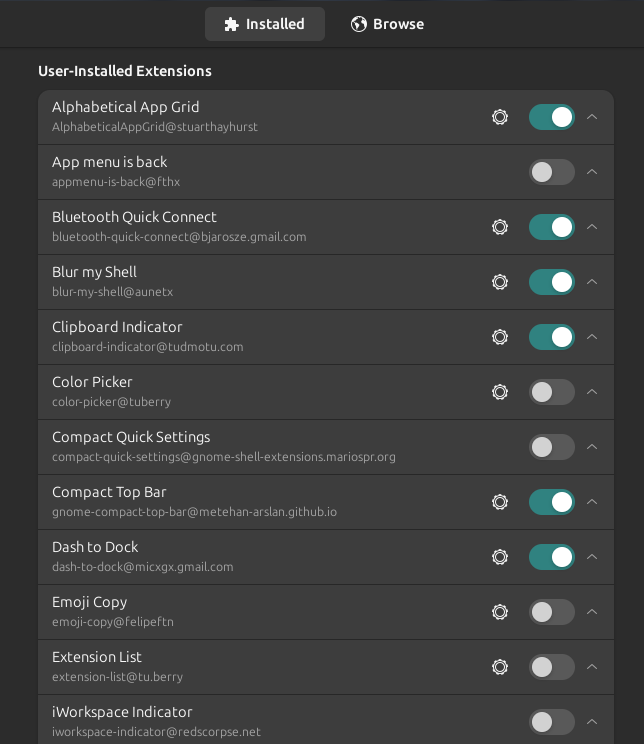

# System Theme & Appearance

## Summary

| Setting | Value |
|---|---|
| GTK theme | `Yaru-bark-dark` |
| Icon theme | `Yaru-bark-dark` |
| Shell theme | `Yaru-bark-dark` (via user-theme extension) |
| Color scheme | `prefer-dark` |
| Wallpaper | `sajek-2024.jpg` — Sajek Valley, 2024. Both versions tracked in `wallpaper/` package: 1920×1080 resized (active) + original 4624×2608. |
| Fonts | Ubuntu Sans 11 (interface), RobotoMono Nerd Font 11 (document), Ubuntu Sans Mono 11 (monospace) |

## Reproducing on a new machine

### 1. Install theme packages

```bash
# Yaru theme (GTK + icons + shell)
sudo apt install yaru-theme-gtk yaru-theme-icon yaru-theme-gnome-shell

# Fonts
sudo apt install fonts-ubuntu
# RobotoMono Nerd Font — download from https://www.nerdfonts.com/font-downloads
# Extract to ~/.local/share/fonts/ then: fc-cache -fv
```

### 2. Restore wallpaper

The wallpaper is tracked in `dotfiles/wallpaper/` and stowed automatically by `install.sh`.
It will appear at:
- `~/.config/background` — 1920×1080, used by Blur My Shell and other extensions
- `~/.local/share/backgrounds/2025-01-05-05-20-03-sajek-2024.jpg` — 1920×1080, used by GNOME background settings
- `~/.local/share/backgrounds/sajek-2024-original.jpg` — original 4624×2608 (phone camera, Sajek Valley 2024)

### 3. Restore full GNOME appearance

Restore from the dconf export (sets GTK theme, icons, fonts, color scheme, wallpaper path all at once):

```bash
dconf load /org/gnome/ < ~/dotfiles/system/gnome/full-settings.dconf
```

> ⚠ This overwrites all GNOME settings. Run on a fresh install, not on a machine with existing customizations you want to keep.

For a safer targeted restore (appearance only):

```bash
dconf load /org/gnome/desktop/interface/ < ~/dotfiles/system/gnome/full-settings.dconf
```

Or use GNOME Tweaks to manually set:
- **Appearance → Applications**: `Yaru-bark-dark`
- **Appearance → Icons**: `Yaru-bark-dark`
- **Appearance → Shell**: `Yaru-bark-dark`
- **Fonts** tab: as listed in the table above

### 4. GNOME extensions

Extensions are listed in `system/gnome/gnome-extensions.dconf`. Key visual ones:

| Extension | Purpose |
|---|---|
| Blur My Shell | Background blur on overview and panel |
| Dash to Dock | Dock behaviour and appearance |
| User Themes | Enables custom GNOME shell theme |
| Space Bar | Workspace label bar |
| Just Perfection | Fine-tune shell visibility and behaviour |
| Compact Top Bar | Smaller top bar |

Restore extension settings:
```bash
dconf load /org/gnome/shell/extensions/ < ~/dotfiles/system/gnome/gnome-extensions.dconf
```

Screenshots of each extension's settings are in `system/img/`.

## Extension screenshots


